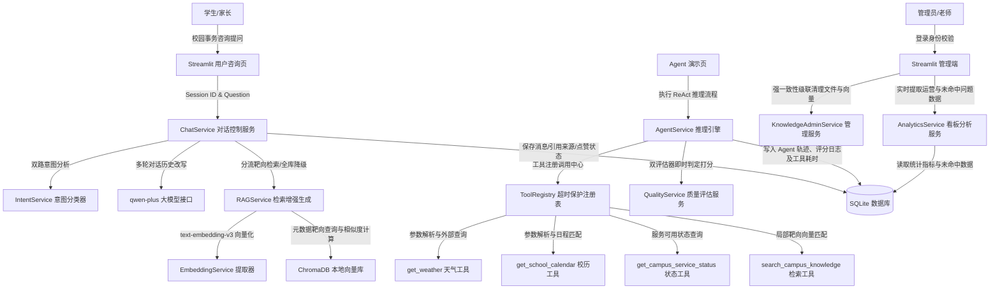
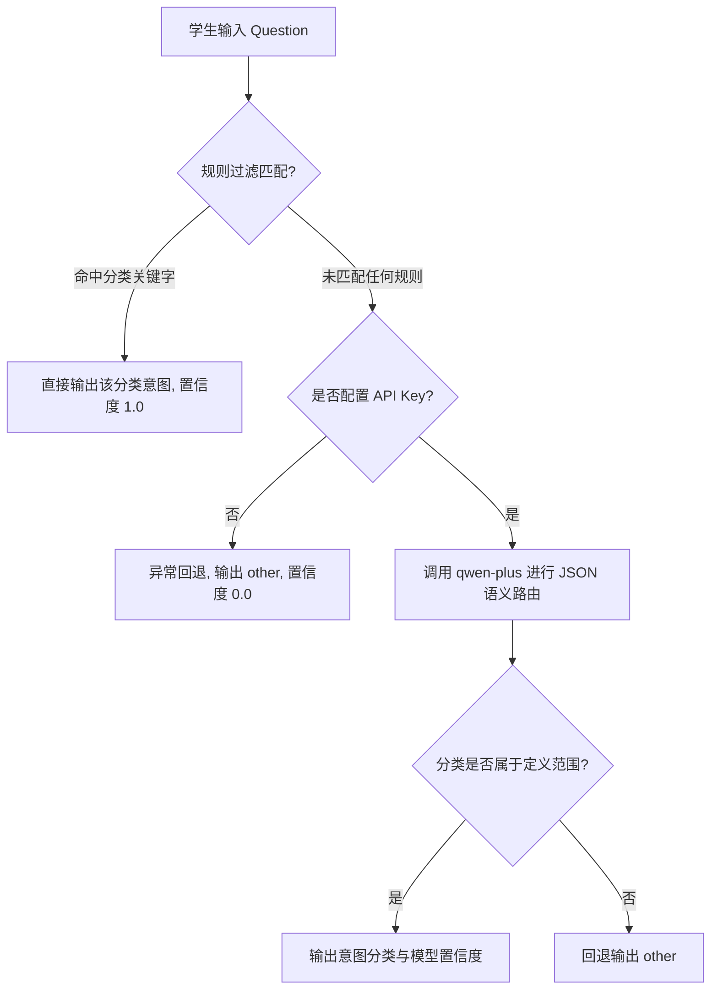

# AIZS｜校园智能咨询平台项目介绍书

## 📋 前言与使用指南

本介绍书是针对 **AIZS｜校园智能咨询平台** 的全景式系统白皮书与技术实现报告。本项目原型为校园智能客服场景，现已重构并升级为 **AIZS｜校园智能咨询平台**。

本文件旨在为**课程设计报告、项目答辩材料、求职简历项目说明及团队交付文档**提供权威、详实、开箱即用的技术描述与架构解析。

---

## 目录

1. [一、 项目概述](#一-项目概述)
2. [二、 项目建设背景与设计初衷](#二-项目建设背景与设计初衷)
3. [三、 总体功能分层与设计指标](#三-总体功能分层与设计指标)
4. [四、 系统总体架构设计](#四-系统总体架构设计)
5. [五、 核心业务逻辑与算法深度剖析](#五-核心业务逻辑与算法深度剖析)
6. [六、 数据库及数据模型设计](#六-数据库及数据模型设计)
7. [七、 安装部署与验收测试指南](#七-安装部署与验收测试指南)
8. [八、 项目总结与后续优化建议](#八-项目总结与后续优化建议)

---

## 一、 项目概述

### 1.1 项目名称与定义
* **项目名称**：AIZS｜校园智能咨询平台
* **英文缩写**：AIZS (AI Zone for School - 校园智能咨询空间)
* **系统定义**：本系统是一个全功能、可追溯、防幻觉、具备级联清理与数据驱动运营闭环的校园智能咨询服务平台。系统融合了 RAG（检索增强生成）技术、双路意图路由、基于 Function Calling 的自主 Agent 推理引擎、双元回答质量评估算法，以及面向校园管理员的知识缺口（未命中问题）统计分析后台。

### 1.2 项目定位与愿景
AIZS 定位于高校信息化建设中的**智能中枢与服务窗口**。通过对散落在校园官网、招生手册、后勤通告、教务规定等各处的非结构化文档进行智能抽取、向量化存储与精准检索，本系统致力于为学生和家长提供全天候、“问有所依、依有所据”的咨询服务。同时，系统通过管理后台将用户的提问偏好和知识未命中盲区呈现给学校管理者，辅助学校进行管理决策与知识库自愈更新。

### 1.3 典型应用场景
1. **招生咨询（Admission Consulting）**：解答考生的录取规则、招生政策、往年分数线免责说明、专业大类特色介绍、录取通知书邮寄状态查询等提问。
2. **学务咨询（Academic Consulting）**：解答在校生的选课指南、期末考试与补考规定、成绩绩点排名查询流程、奖助学金申请条件及学籍异动手续等。
3. **后勤咨询（Logistics Consulting）**：解答宿舍断电断网时间、食堂营业时段及微信支付状态、图书馆借阅与续借规则、设备报修、校医院报销流程等日常服务。
4. **校园生活咨询（Campus Life Consulting）**：指导学生加入吉他社等社团、查询校园大巴时刻表、校园网办理与交费方式、文体场馆开放安排等。
5. **管理人员知识库维护与运营分析**：招办老师、学务后勤主管可在后台管理入库资料，实时查看 Plotly 运营看板，追踪被学生“点踩”的差评回复，以及通过未命中提问排行榜发现缺失的政策内容。

### 1.4 目标用户群体与画像
* **高考生及家长**：关注专业实力、分数线及报到材料。信息获取迫切但对高校结构不熟悉，容易被网络杂乱信息误导。
* **在校本科生及研究生**：关注选课、请假、奖学金申请、宿舍报修等日常切身利益。提问常带有模糊语意和多轮追问的特征。
* **招办及教学秘书**：负责维护学校招生政策与教务文件，需要快速导入/更新文档，分析考生关注的热门焦点。
* **后勤管理人员**：需要统计学生对宿舍漏水报修、食堂菜品反馈等服务日志，优化后勤保障资源分配。
* **系统运维人员**：负责数据库维护、百炼 API 连通性测试、硬件依赖状态巡检，以保证系统稳定运行。

### 1.5 核心商业与学术价值
* **7×24 小时在线解答**：将人工客服从 80% 的高频重复问题中解放出来，实现秒级流式应答。
* **来源可追溯的防幻觉方案**：坚持“严守知识边界”的设计原则。每次作答都必须在界面下方列举所引用的文件物理页码或片段索引，杜绝大模型“瞎编”电话号码或政策时间。
* **数据驱动的运营闭环**：不仅解决“学生提问”，更解决“学校不知道学生缺什么知识”。未命中统计模块能动态捕捉系统无法回答的问题，指导内容增量更新。
* **复合推理处理复杂任务**：基于 Agent 多步执行机制，允许系统拆解涉及天气、校历与本地知识库的复合式提问，实现跨渠道数据联动。

---

## 二、 项目建设背景与设计初衷

### 2.1 传统校园咨询的现实痛点
1. **咨询波峰波谷极度分化**：在每年 6-7 月招生季以及 9 月迎新季，学校招办及学工系统面临海量电话与邮件轰炸，人工客服超负荷运转；而日常时段则相对冷清，固定的人工客服岗位造成了编制与资源的浪费。
2. **信息壁垒与规章碎片化**：高校内各部门（教务处、招办、图书馆、后勤处、校医院）的规章制度文件格式各异（PDF、Word、TXT），分散存储在不同的二级网站中，学生和家长极难一站式获取完整准确的解答。
3. **传统自然语言客服死板僵硬**：第一代基于关键词或倒排索引的校园客服机器人，只能回答完全吻合的“一问一答”条目，遇到同义词替换或逻辑转弯时便无能为力。
4. **大语言模型（LLM）的“幻觉”致命伤**：直接使用 ChatGPT 或通用的商业大模型，因为缺乏特定学校的内部数据支撑，会在面对“报到地点在哪个校区”、“校长信箱是多少”时，自信地编造错误的电话或日期，这在教育和政策咨询场景中是绝对无法接受的。

### 2.2 本系统的创新解决方案
针对上述痛点，AIZS 平台从零构建了基于大模型语义理解的智能检索增强生成系统（RAG）与智能代理服务（Agent）：
* **基于双路混合匹配的意图路由器与检索加权**：使用“本征规则快速拦截 + LLM 语义大类识别”的双路算法进行意图分类。检索时基于“全库优先+分类加权+通用资料补充”的 retrieve 机制，自动对各分类相似度分数进行轻量排序加权，既实现相关度加权增强，又避免了分类硬过滤阻断跨分类真实资料的召回。
* **带有物理页码追踪的文档切片引擎**：自主实现了滑动窗口文本切分算法，能够自适应解析 Word、TXT 及多页 PDF。尤其是 PDF 文档，解析时能够提取出精确的物理页码并持久化，使得最后的溯源结果可精准定位至“第 X 页”。
* **双评估器保障回答质量**：系统集成了“基于硬性规则的负反馈扣分与防编造核准”和“大模型多维语义打分”的双评估器。一旦大模型生成了没有本地知识来源的政策内容，系统会自动判定其为“低质量回答”并打上缺陷标签，提示管理员进行人工审核。
* **未命中盲区自愈闭环**：通过 SQLite 统计检索距离大于 0.8 的无来源记录，提供 Top 10 未命中问题排行榜，打通了“数据分析-知识发现-文档导入-服务升级”的完整闭环。

### 2.3 教学演示性质声明
> [!IMPORTANT]
> 本系统附带的所有预置文件（如 `01_演示_图书馆服务指南.pdf`、`02_演示_奖助学金管理办法.pdf`等）均为**演示模拟数据**，其中所载的日期、电话、地点等均非官方真实规定。本平台仅作为技术开发、教学演示与答辩展示使用。

---

## 三、 总体功能分层与设计指标

AIZS 项目的功能实现完整地划分为三个层级，各个层级间逻辑解耦、功能互补，为平台构建了坚实的阶梯式交付体系。

| 功能层级 | 核心功能点 | 技术实现要点 | 交付与验收硬性指标 |
| :---: | :--- | :--- | :--- |
| **基础档** | • 多格式文档解析<br>• 滑动窗口文本切分<br>• text-embedding-v3 提取<br>• ChromaDB 语义检索<br>• 对话上下文改写<br>• 物理页码/片段追溯<br>• 会话历史存档与切换 | • 自研 `ChineseTextSplitter` 句级分切<br>• RAG 距离过滤（余弦距离 ≤ 0.8）<br>• 历史消息缓存与 LLM 重写检索词<br>• pypdf 物理页码计算<br>• SQLite 会话持久化机制 | • 物理文件能解析并自动计算 SHA-256 避重入库<br>• 在演示知识库覆盖范围内可稳定召回<br>• 引用来源折叠展示，PDF 显式输出物理页码<br>• 消除上一轮指代词（如“它”、“那里”） |
| **进阶档** | • 管理后台主界面<br>• 知识库分级与分类<br>• 强一致级联删除<br>• 双路意图路由器<br>• Plotly 实时数据看板<br>• 会话审计日志多维筛选<br>• 赞/踩即时反馈系统<br>• 未命中（无来源）统计看板<br>• **知识库批量导入与表格批量删除**<br>• **统一前端样式与空值保护** | • `app.py` 提供管理员账户校验限制及双端侧边栏导航隔离<br>• 规则关键词匹配 + qwen-plus 语义意图分类<br>• 意图分类结合 retrieve 算法进行检索加权排序（全库优先+分类增强）<br>• SQLite 级联删除文档、向量、消息及本地文件，采用 `st.data_editor` 高性能勾选<br>• 统计无来源问题 Top 10 列表并用 Pandas 汇总展示<br>• 批量上传、ZIP导入防御及物理免删保护 `demo_documents`<br>• `utils/ui_utils.py` 统一全局 CSS 样式与通用 UI 组件<br>• `utils/display_utils.py` 空值安全保护，防止空值参与运算 | • 意图路由分类准确率 **> 80.0%**<br>• 支持按日期、意图、只看点踩、是否无来源等多维审计<br>• 支持已入库文档的全选、取消全选与二次确认安全批量删除<br>• 批量删除与失败记录一键清理保持完全隔离与功能独立<br>• 所有空数据状态显示中文友好提示<br>• 无 API Key 时页面不崩溃 |
| **挑战档** | • Function Calling 推理 Agent<br>• 主动澄清模糊问题<br>• 超时控制工具注册表<br>• 多维度工具集联动<br>• Agent 执行轨迹可视化<br>• 规则+LLM 双源质量评估<br>• 差评与低质量审计报表 | • `AgentService` 控制 ReAct 执行循环（最大3轮）<br>• `check_clarification` 拦截无上下文的模糊提问<br>• `tool_registry` 包装工具，8秒超时抛出异常<br>• 天气、校历、服务状态与知识检索工具链<br>• `QualityService` 执行双重算分及低质量特征标记 | • 复合问题（材料 + 天气）多步成功推理<br>• 模糊词（如“怎么报名”）首次进入时主动澄清<br>• 前端直观呈现流程图谱式 Agent 轨迹链<br>• 自动判定“无源政策性回答”为低质量并提出建议<br>• 工具审计日志记录入参、出参和毫秒级耗时 |

---

## 四、 系统总体架构设计

AIZS 校园智能咨询平台在系统架构设计上遵循**高内聚、低耦合、层级分明**的经典架构原则，采用基于 Streamlit 的多页面单体应用架构，内部按页面层、服务层、数据访问层和存储层进行分层设计，结合轻量级数据存储和百炼大模型托管服务。

### 4.1 系统逻辑架构
系统的数据和控制流向由以下 Mermaid 流程图清晰呈现：



### 4.2 物理层与目录结构对应关系

```text
AIZS/ (工作区根目录)
├─ app.py                          # Streamlit 主入口（含 SQLite 库表初始化自检）
├─ config/
│  └─ settings.py                  # 配置中心（通过 Path 动态计算根目录，解决物理更名后路径问题）
├─ page_views/                     # 当前页面渲染视图层，由 app.py 状态机按需调用
├─ services/                       # 核心业务逻辑服务层（大模型、向量、解析、检索、意图、统计、Agent）
├─ repositories/                   # 数据访问层（SQLite 仓储与 ChromaDB 持久化交互）
├─ utils/                          # 通用工具集（语义切分器、Windows编码修正、空值安全格式化、统一前端样式）
├─ scripts/                        # 运维与评估命令行工具（重置数据、意图评测、挑战档命令行演示）
├─ tests/                          # 单元测试模块（内含 100 条 CSV 意图分类评测集）
├─ archive/                        # 历史入口与旧 pages 归档，不参与当前主流程
└─ data/                           # 物理持久化存储（被 .gitignore 忽略）
   ├─ raw_documents/               # 上传文档物理磁盘存储
   ├─ chroma_db/                   # ChromaDB 向量本地存储
   └─ campus_service.db            # SQLite 关系型数据库文件
```

### 4.3 核心技术选型参数
1. **基础语言**：Python 3.11.x（保障大模型库与向量数据库异步通信的高效与安全）。
2. **关系数据库**：SQLite 3（轻量、单文件存储，支持外键约束开启，适用于中小型高校或部门原型演示）。
3. **向量数据库**：ChromaDB（使用本地持久化存储机制，使用 HNSW 索引，相似度空间定义为余弦相似度 `hnsw:space = cosine`）。
4. **模型基础设施**：阿里云百炼大模型托管（DashScope），通过标准的 OpenAI 兼容客户端（OpenAI SDK）进行调用，选用 `qwen-plus` 保证推理和意图判定的高鲁棒性，选用 `text-embedding-v3` 提取 1536 维高质量文本语义特征向量。
5. **前端交互与可视化**：Streamlit 框架 + Plotly 图表库（实现零 HTML/JS 编写的响应式、具有玻璃磨砂感（Premium Style）的专业 UI 界面）。

### 4.4 用户端与管理端单入口双模式状态分流设计
为了使系统更贴近真实的企业级交付产品，系统在应用入口和页面展现上实施了用户端和管理端的一体化状态分流设计：
1. **唯一应用门户 (`app.py`)**：系统通过单一命令 `streamlit run app.py` 启动。内部使用状态机 `st.session_state.app_mode`（取值为 `"home"`, `"user"`, `"admin"`）来管控当前运行模式。
2. **产品级门户首页**：当 `app_mode == "home"` 时，系统为主导门户首页。通过在 `.streamlit/config.toml` 中配置 `showSidebarNavigation = false` 屏蔽 Streamlit 默认的多页面文件列表，并在页面中注入 CSS 彻底隐藏侧边栏。顶部品牌区展示平台名称、简介和功能标签；中部两个入口卡片（用户端/管理端）；底部功能亮点展示。全局 CSS 样式通过 `utils/ui_utils.py` 统一管理，确保各页面视觉风格一致。
3. **用户端分流**：当切换为 `user` 模式时，系统展示面向学生和家长的咨询端。侧边栏仅渲染用户相关菜单（`智能咨询`、`对话历史`、`Agent演示`），并提供返回系统首页的按钮。统一 CSS 风格，聊天气泡、来源引用卡片、空数据友好提示。页面渲染逻辑均在 `page_views/` 目录下完成隔离。
4. **管理端登录隔离**：当切换为 `admin` 模式时，系统展示面向管理员与教师的控制后台。首次进入时仅显示管理员登录框，登录框居中展示，提示“请以管理员身份登录后访问管理后台”。在登录验证通过前，绝不加载任何管理端子页面，不访问数据库，不连接向量数据库，保证系统运行的轻量级与安全性。登录成功后展示管理端导航列表与退出登录、返回首页按钮。

---


## 五、 核心业务逻辑与算法深度剖析

本章节将系统梳理 AIZS 系统在数据解析、意图分流、Agent 循环以及评估算法上的底层数学公式、关键代码片段及 Prompt 原理。

### 5.1 RAG (检索增强生成) 管道机制与文本切分算法

#### 1. 语义滑动窗口文本切分算法
为保证文本片段入库后的语义连贯性，避免在句子中间被拦腰折断，系统在 `utils/text_splitter.py` 中实现了一个精细的中文切分器 `ChineseTextSplitter`。

```python
class ChineseTextSplitter:
    def __init__(self, chunk_size: int = 500, chunk_overlap: int = 100):
        self.chunk_size = chunk_size
        self.chunk_overlap = chunk_overlap

    def split_text(self, text: str) -> List[str]:
        # 1. 使用正则表达式将中文长文本按标点符号分句
        sentences = re.split(r'([。！？\?!\n\r])', text)
        # 将句子和其对应的标点符号合并
        sentence_list = []
        for i in range(0, len(sentences) - 1, 2):
            sentence_list.append(sentences[i] + sentences[i+1])
        if len(sentences) % 2 == 1:
            sentence_list.append(sentences[-1])
            
        chunks = []
        current_chunk = ""
        
        # 2. 滑动窗口逻辑
        for sentence in sentence_list:
            if len(current_chunk) + len(sentence) <= self.chunk_size:
                current_chunk += sentence
            else:
                if current_chunk:
                    chunks.append(current_chunk.strip())
                # 计算 overlap 重叠长度，向前回溯一部分文本
                overlap_text = current_chunk[-self.chunk_overlap:] if len(current_chunk) > self.chunk_overlap else current_chunk
                current_chunk = overlap_text + sentence
        if current_chunk:
            chunks.append(current_chunk.strip())
        return chunks
```
通过滑动窗口与重叠控制（默认窗口 500 字，重叠 100 字），切片重叠区间确保了切缝处上下文语义（如上下文代词指代关系）不会因硬性裁剪而丢失。

#### 2. PDF 页码提取算法
在 `services/document_service.py` 中，针对 `.pdf` 文件，系统并没有进行全局拼合后再切分，而是**逐页**进行提取，利用 `pypdf` 将物理页码与文本深度绑定，为物理页码回溯奠定了基石。
```python
def parse_pdf(file_path: str) -> List[Dict[str, Any]]:
    reader = PdfReader(file_path)
    parsed_pages = []
    for page_idx, page in enumerate(reader.pages):
        text = page.extract_text()
        if text.strip():
            parsed_pages.append({
                "page_number": page_idx + 1,  # 物理页码从 1 开始
                "text": text
            })
    return parsed_pages
```
切分时，针对 PDF 类型会在元数据中保存当前切片的物理页码 `page_number`；对于 Word/TXT，则自动在元数据中写入生成出的切片自增索引 `chunk_index`。

#### 3. 相似度距离度量与阈值过滤
系统使用的是**余弦相似度（Cosine Similarity）**进行检索度量，在本地向量库中通过如下公式转换余弦距离（Cosine Distance）：

$$\text{Similarity} = 1 - \text{Cosine Distance}$$

ChromaDB 返回的 `distances` 为余弦距离值（范围为 0.0 到 2.0，0.0 代表完全相同，2.0 代表方向相反）。在 `repositories/chroma_repository.py` 和 `services/rag_service.py` 中，系统采用硬性阈值配置：
```python
RAG_DISTANCE_THRESHOLD = 0.8  # 在配置 settings.py 中设定
```
如果检索结果的余弦距离 $D > 0.8$（即相似度小于 20%），该切片会被系统直接抛弃，不进入大模型上下文，以此确保模型的回答完全基于强相关的参考资料。

---

### 5.2 意图路由分类算法

为提高多语噪环境下知识检索的抗干扰能力，`IntentService` 采取了**“规则拦截优先 + 大模型兜底路由”**的双路架构。



#### 1. 大模型语义分类 Prompt 设计
```ini
【System Prompt】
你是一个高校业务意图分类专家。你的任务是根据学生或家长的提问（query），将其精准归类为以下五个大类之一：
- admission（招生咨询）：关于分数线、报考大类、录取通知书、寄递状态、新生报到地点、学费金额等。
- academic（学务教务）：关于选课、休学、成绩绩点、奖学金、助学金、不及格补考、学籍异动、免试保研等。
- logistics（后勤服务）：宿舍断电断网时间、食堂微信支付、图书馆续借规定、宿舍漏水报修、校医院报销等。
- campus_life（校园生活）：社团加入、大巴校车时刻表、校园网月套餐费用、健身房预约等。
- other（其他事务）：日常闲聊、天气情况、问候或与上述校园事务完全无关的技术/数学/翻译等通用提问。

【输出约束】
必须只返回符合 JSON 规范的字符串，不要有任何 markdown 标记。格式如下：
{"intent": "分类标识名", "confidence": 0.0~1.0 之间的置信度, "reason": "核心依据简述"}
```
#### 2. 分类直接过滤与检索降级回退
在 `ChatService` 聊天控制流中，意图路由的输出将直接改变 RAG 的匹配过程：
* 如果识别意图的置信度大于等于 **0.65**，且意图非 `other`，ChromaDB 检索时将加入 metadata 过滤条件：`where={"category": intent}`。这能瞬间排除非相关大类的文档干扰（例如提问“查绩点在哪里”，仅匹配“学务”类文件，绝不扫描图书馆规则）。
* **降级回退（Fallback）**：若靶向检索后返回的结果集为空，为了避免由于分类偏差导致回答“找不到依据”，系统会自动触发检索降级，卸载 category 过滤器，对向量库执行一次全局余弦检索，提升系统的鲁棒性。

---

### 5.3 Agent 自主多步推理与 Function Calling 执行机制

对于复合提问（例如：*“新生报到去哪个校区？明天南京天气怎么样？”*），传统 RAG 无法处理跨模态、跨渠道的查询。AIZS 引入了基于 ReAct 推理循环的智能 Agent 引擎。

#### 1. Agent 逻辑控制循环（ReAct Loop）
在 `services/agent_service.py` 中，Agent 的执行循环控制如下：
1. **初始化**：加载系统 Prompt（提示 Agent 拥有哪些工具）。
2. **大模型调用（带 Tool Schemas）**：调用百炼 `qwen-plus` 接口，传入 `tools` 列表和当前对话历史。
3. **判断是否需要执行工具**：大模型会分析用户提问，若返回 `tool_calls`，则暂停文本流生成，转入工具分发逻辑。若无 `tool_calls`，说明信息已收集齐备，跳出循环。
4. **工具分发执行**：顺序读取大模型要求调用的工具名（如 `get_weather`）和参数（如 `{"city": "南京", "date": "明天"}`）。
5. **入库与 Trace 写入**：调用 `call_tool` 执行具体的 Python 工具代码，并将工具结果转换为文本塞回大模型 messages 历史：
   `messages.append({"role": "tool", "tool_call_id": ..., "name": ..., "content": tool_result})`
6. **循环步数递增**：`loop_count += 1`。若超出 3 轮，则硬性终止，防止发生死循环消耗 API 费用。

#### 2. Agent 执行轨迹 Trace 可视化设计
每次 Agent 决策（意图分析、工具调用、工具返回、最终文本流生成）都会通过 `sqlite_repository.save_agent_trace` 实时入库，且在 Streamlit 页面前端使用气泡及折叠卡片渲染。每个步骤都包含 `step_index`、`step_title` 以及入参/出参的格式化快照。

---

### 5.4 外部辅助工具集定义

为支持 Agent 推理，在 `services/tool_registry.py` 和对应工具模块中，平台统一定义并注册了四个核心 API 工具：

```python
# 1. 校园知识库检索工具 (靶向检索)
{
    "name": "search_campus_knowledge",
    "description": "专门用于检索校园规定、政策、指南、规章制度等文本知识。支持按业务分类进行靶向过滤检索。",
    "parameters": {
        "type": "object",
        "properties": {
            "query": {"type": "string", "description": "检索关键词或问题描述"},
            "category": {
                "type": "string", 
                "enum": ["admission", "academic", "logistics", "campus_life"],
                "description": "靶向过滤分类，如果不确定可以不传"
            }
        },
        "required": ["query"]
    }
}

# 2. 天气查询工具 (Mock 接口，演示用)
{
    "name": "get_weather",
    "description": "查询指定城市指定日期的天气预报信息（仅用于展示工具调用功能，数据为演示 Mock 数据）。",
    "parameters": {
        "type": "object",
        "properties": {
            "city": {"type": "string", "description": "城市名称，如 '南京'、'北京'"},
            "date": {"type": "string", "description": "日期描述，如 '今天'、'明天'、'后天'"}
        },
        "required": ["city", "date"]
    }
}

# 3. 校历安排查询工具 (Mock 接口，演示用)
{
    "name": "get_school_calendar",
    "description": "查询校园重要日程、开学放假日期、考试周等校历事件信息（演示数据）。",
    "parameters": {
        "type": "object",
        "properties": {
            "query": {"type": "string", "description": "日程检索关键字，如 '放假'、'开学'、'期末'"}
        },
        "required": ["query"]
    }
}

# 4. 校园服务状态查询工具
{
    "name": "get_campus_service_status",
    "description": "查询校园核心公共服务设施（图书馆、自习室、校车、食堂）当前的实时开放与运行状态（演示数据）。",
    "parameters": {
        "type": "object",
        "properties": {
            "service_name": {
                "type": "string",
                "enum": ["图书馆", "自习室", "校车", "食堂"],
                "description": "服务设施名称"
            }
        },
        "required": ["service_name"]
    }
}
```
**安全边界与超时控制**：在 `tool_registry.py` 中，执行每次工具调用都会开启线程级监控，若工具在 8 秒内未返回结果，系统会自动截断抛出 TimeoutError，防止由于第三方接口卡死导致整个 Streamlit 会话挂起。

---

### 5.5 双源回答质量自动评估机制

系统采用独特的**双评估器（Double Evaluator）**模型保障交付后的每次应答均处于质量监控下。

#### 1. 规则评估逻辑（有迹可循）
通过结构化参数（提问、应答、来源列表、工具执行日志、点踩反馈）进行基于公式因子的判定：

$$S_{\text{rule}} = 3 + \Delta_{\text{source}} + \Delta_{\text{tool}} + \Delta_{\text{unanswered}} - \Delta_{\text{policy}} - \Delta_{\text{feedback}}$$

* **基础分 ($3$)**。
* **有来源引入 ($\Delta_{\text{source}} = +1$)**。
* **工具成功执行 ($\Delta_{\text{tool}} = +1$)**，部分失败则扣 1 分。
* **诚实说明没有证据 ($\Delta_{\text{unanswered}} = +1$)**：如果回答命中“未检索到相关依据”且确实没有来源，奖励 1 分，鼓励诚实作答。
* **未查阅知识库强行回答政策风险 ($\Delta_{\text{policy}} = -2$)**：无来源，但用户提问包含“招生”、“成绩”、“奖学金”等敏感词，判定为编造政策，扣 2 分。
* **用户点踩差评 ($\Delta_{\text{feedback}} = -2$)**。
* 得分范围限制在 $[1, 5]$ 分内。如果得分 $< 3$ 或触发政策风险扣分，直接打上“低质量回答”标签。

#### 2. 大模型评估逻辑（多维语义）
调用百炼模型对生成的客服回答进行交叉核验。大模型评估 prompt 详细要求其检查：
- **事实一致性（Hallucination Check）**：回答是否包含了检索来源中不存在的具体数据（如电话、日期）。
- **相关性（Relevance Check）**：回答是否正面解答了用户的提问，有无答非所问。
- **完备性（Completeness Check）**：对复合提问的各个咨询点是否均有涉及。
评估结果（分数、缺陷特征列表、优化改进建议）以标准的 JSON 报表存入数据库。当用户在咨询前台点击赞/踩按钮时，系统会触发**反馈重评**机制，利用 `QualityService.evaluate_and_save` 重新计算质量分。

---

### 5.6 知识库未命中统计与自闭环运营设计

为打通内容建设的下半场，系统在后台对检索相似度全低于阈值（0.8）且大模型被迫以闲聊或兜底拒答的信息（`has_source = 0`）进行统计。
在 `AnalyticsService` 中实现如下：
- **无来源率计算**：直接利用 SQLite 关系代数：

$$\text{无来源率} = \frac{\text{messages 表中 } has\_source=0 \text{ 且 role='assistant' 的行数}}{\text{messages 表中 role='assistant' 的总行数}} \times 100\%$$

- **未命中 Top 10 SQL 查询**：
  ```sql
  SELECT m_usr.content AS question, COUNT(*) AS miss_count
  FROM messages m_ast
  JOIN messages m_usr ON m_ast.session_id = m_usr.session_id
    AND m_usr.role = 'user'
    AND m_usr.rowid = (
        SELECT MAX(rowid) FROM messages 
        WHERE session_id = m_ast.session_id 
          AND role = 'user' 
          AND rowid < m_ast.rowid
    )
  WHERE m_ast.role = 'assistant' AND m_ast.has_source = 0
  GROUP BY m_usr.content
  ORDER BY miss_count DESC
  LIMIT 10;
  ```
这行复杂的关联子查询 SQL 实现了“精准定位无来源客服回答所对应的上一轮用户提问”，并对其分组求和，为学校管理员呈现出高频未命中的热点提问。

### 5.7 知识库批量导入与压缩包安全防御机制
为了提高知识库录入效率并保障系统不受恶意文件的危害，AIZS 部署了全新的批量导入服务 [BatchImportService](file:///d:/AIZS/services/batch_import_service.py)：
1. **隔离性事务处理 (Error Isolation)**：在批量处理多个文件时（例如多文件上传或演示文档一键入库），系统采用独立事务机制。每个文件在独立的 try/except 块中解析、Embedding 和 Chroma 写入。单个文件解析失败或向量数据库写入故障，不会阻断后续其他文件的正常入库。
2. **ZIP 解压与过滤机制**：系统支持上传并自动解压 `.zip` 压缩包。解压过程中，系统自动扫描并只保留 `.pdf`、`.docx`、`.txt` 三类合规格式文件，自动忽略不支持的其余格式，减少垃圾数据。
3. **Zip Slip 路径穿越防御算法**：
   在 ZIP 压缩包解压中，存在攻击者将文件名伪造为包含 `../` 相对路径（例如 `../../etc/passwd`）以此覆盖系统关键文件（Zip Slip 漏洞）的风险。AIZS 在解压阶段实现了基于 Path 解析的绝对路径校验防御：
   ```python
   target_path = Path(os.path.join(temp_dir, filename)).resolve()
   if not target_path.is_relative_to(Path(temp_dir).resolve()):
       # 拒绝解压并记录安全审计失败日志
       raise ValueError("安全验证失败：禁止路径穿越文件写入")
   ```
   该算法确保解压出来的所有物理文件必须位于系统分配的独立临时目录之内，解压并导入结束后，系统自动删除临时解压目录，保障系统安全无残留。

---


## 六、 数据库及数据模型设计

AIZS 结合了关系型数据库（持久化业务数据、日志与轨迹）与向量数据库（高维语义匹配），实现了两路数据的协调统一。

### 6.1 关系型数据库 (SQLite) 表结构设计

SQLite 数据表间关系图：

```
 [chat_sessions] 1 --- * [messages] 1 --- * [message_sources]
                          1 
                          |
                          +--- 0..1 [feedback]
                          |
                          +--- 0..1 [quality_evaluations]
                          |
                          +--- * [agent_traces]
                          |
                          +--- * [tool_logs]
 
 [documents] (独立文档表，与物理磁盘文件及 ChromaDB 同步)
```

#### 1. documents 表（知识库文档索引）
```sql
CREATE TABLE IF NOT EXISTS documents (
    doc_id TEXT PRIMARY KEY,               -- 文档唯一ID (UUID)
    file_name TEXT NOT NULL,               -- 磁盘原始文件名
    file_path TEXT NOT NULL,               -- 磁盘物理保存路径
    file_type TEXT NOT NULL,               -- 文件后缀名 (pdf, docx, txt)
    file_hash TEXT UNIQUE NOT NULL,        -- 文件 SHA-256 哈希值，用于查重去重
    uploaded_at TEXT NOT NULL,             -- 上传时间戳
    status TEXT NOT NULL,                  -- 处理状态 (processing, completed, failed)
    chunk_count INTEGER DEFAULT 0,         -- 文档切分切片总数
    category TEXT DEFAULT 'other',         -- 分类标识 (admission/academic/logistics/campus_life/other)
    category_name TEXT DEFAULT '其他',      -- 分类中文展示名
    deleted_at TEXT,                       -- 软删除时间戳（如果使用，默认为 NULL）
    error_message TEXT                     -- 解析异常记录
);
```

#### 2. chat_sessions 表（历史会话记录）
```sql
CREATE TABLE IF NOT EXISTS chat_sessions (
    session_id TEXT PRIMARY KEY,           -- 会话唯一ID (UUID)
    title TEXT NOT NULL,                   -- 会话自适应标题 (首问自动截取前15字)
    created_at TEXT NOT NULL,              -- 创建时间
    updated_at TEXT NOT NULL               -- 更新时间
);
```

#### 3. messages 表（单笔聊天消息明细）
```sql
CREATE TABLE IF NOT EXISTS messages (
    message_id TEXT PRIMARY KEY,           -- 消息唯一ID (msg-uuid)
    session_id TEXT NOT NULL,              -- 会话关联外键
    role TEXT NOT NULL,                    -- 角色 (user/assistant)
    content TEXT NOT NULL,                 -- 提问/回答主体内容
    created_at TEXT NOT NULL,              -- 创建时间
    intent TEXT,                           -- 意图分类标识名
    intent_name TEXT,                      -- 意图分类中文名
    intent_confidence REAL,                -- 置信度分数 (0.0~1.0)
    intent_reason TEXT,                    -- 意图分类依据
    rewritten_query TEXT,                  -- 对话多轮改写后的检索词
    has_source INTEGER DEFAULT 0,          -- 是否有来源引用 (0: 否, 1: 是)
    response_time_ms INTEGER,              -- 服务端处理耗时（毫秒）
    agent_mode INTEGER DEFAULT 0,          -- 是否是 Agent 多步推理回答 (0/1)
    tool_used INTEGER DEFAULT 0,           -- 是否触发了工具调用 (0/1)
    quality_score INTEGER,                 -- 人工反馈触发前的预评估质量分 (1~5)
    is_low_quality INTEGER DEFAULT 0,      -- 是否低质量 (0/1)
    FOREIGN KEY (session_id) REFERENCES chat_sessions(session_id) ON DELETE CASCADE
);
```

#### 4. message_sources 表（回答所引用的知识库段落明细）
```sql
CREATE TABLE IF NOT EXISTS message_sources (
    source_id TEXT PRIMARY KEY,            -- 来源明细ID
    message_id TEXT NOT NULL,              -- 关联助手消息ID
    doc_id TEXT NOT NULL,                  -- 关联知识文档ID
    chunk_id TEXT NOT NULL,                -- 向量集合对应ID (doc_id_chunk_index)
    file_name TEXT NOT NULL,               -- 文件名备份
    page_number INTEGER,                   -- 物理页码（PDF专有，其余为 NULL）
    chunk_index INTEGER NOT NULL,          -- 切片绝对顺序索引
    source_text TEXT NOT NULL,             -- 引用切片原文片段
    similarity_distance REAL NOT NULL,     -- 余弦匹配距离值
    FOREIGN KEY (message_id) REFERENCES messages(message_id) ON DELETE CASCADE
);
```

#### 5. feedback 表（用户即时评分表）
```sql
CREATE TABLE IF NOT EXISTS feedback (
    feedback_id TEXT PRIMARY KEY,
    message_id TEXT UNIQUE NOT NULL,       -- 对应消息ID (强约束一消息仅能有一评分)
    session_id TEXT NOT NULL,
    rating TEXT NOT NULL,                  -- 点赞/点踩等级 (like/dislike)
    comment TEXT,                          -- 管理改进反馈意见
    created_at TEXT NOT NULL,
    FOREIGN KEY (message_id) REFERENCES messages(message_id) ON DELETE CASCADE
);
```

#### 6. tool_logs 表（Function Calling 工具执行审计日志）
```sql
CREATE TABLE IF NOT EXISTS tool_logs (
    tool_log_id TEXT PRIMARY KEY,
    session_id TEXT,
    message_id TEXT,                       -- 生成该条回答时调用的工具
    tool_name TEXT NOT NULL,               -- 调用的 Python 方法名称
    tool_display_name TEXT,                -- 工具中文别名
    tool_args TEXT,                        -- 传入参数的 JSON 串
    tool_result TEXT,                      -- 工具输出的原始文本 JSON 串
    success INTEGER,                       -- 是否执行成功 (0/1)
    error_message TEXT,                    -- 运行报错栈
    elapsed_ms INTEGER,                    -- 工具运行耗时（毫秒）
    created_at TEXT NOT NULL
);
```

#### 7. agent_traces 表（Agent 决策轨迹快照表）
```sql
CREATE TABLE IF NOT EXISTS agent_traces (
    trace_id TEXT PRIMARY KEY,
    session_id TEXT,
    message_id TEXT,
    step_index INTEGER,                    -- 决策步骤序号 (1, 2, 3...)
    step_type TEXT,                        -- 步骤类型 (analyze/composite_detect/tool_call/tool_result/generate)
    step_title TEXT,                       -- 步骤标题
    step_detail TEXT,                      -- 详情快照
    created_at TEXT NOT NULL
);
```

#### 8. quality_evaluations 表（回答质量诊断结果表）
```sql
CREATE TABLE IF NOT EXISTS quality_evaluations (
    evaluation_id TEXT PRIMARY KEY,
    message_id TEXT NOT NULL,
    session_id TEXT NOT NULL,
    score INTEGER,                         -- 综合质量分 (1~5)
    is_low_quality INTEGER,                -- 是否属于低质量 (0/1)
    issues TEXT,                           -- 缺陷列表（多个用英文逗号分隔）
    suggestion TEXT,                       -- 人工调优建议
    evaluator TEXT,                        -- 评估器类型 (rule/llm/feedback_re-eval)
    created_at TEXT NOT NULL,
    FOREIGN KEY (message_id) REFERENCES messages(message_id) ON DELETE CASCADE
);
```

---

### 6.2 向量数据库 (ChromaDB) 集合与元数据 (Metadata) 靶向过滤设计

在 `repositories/chroma_repository.py` 中，ChromaDB 集合被配置为：
- **集合名称 (Collection Name)**：`campus_knowledge`
- **度量空间 (Space)**：余弦空间（cosine）
- **单条向量属性（Metadata Schema）**：
  在写入 Chroma 时，每个切片不仅保存切片文本 `documents=chunk_text` 和嵌入特征向量 `embeddings=chunk_vector`，还必须附加如下 metadata：
  ```json
  {
    "doc_id": "UUID 字符串",
    "file_name": "01_演示_图书馆服务指南.pdf",
    "file_type": "pdf",
    "category": "logistics",
    "category_name": "后勤",
    "page_number": 2, // 针对 PDF。Word/TXT 为 -1 并会在查询时自适应解析为 None
    "chunk_index": 5
  }
  ```
  在检索阶段，系统利用 ChromaDB 内置的 where 语法实现靶向搜索过滤：
  ```python
  results = self.collection.query(
      query_embeddings=[query_embedding],
      n_results=top_k,
      where={"category": category} # 靶向过滤
  )
  ```
  这直接在底层屏蔽了无关分类下的向量扰动，显著提升了垂直领域 RAG 的检索效率。

---

### 6.3 哈希校验去重与物理删除强一致性控制

#### 1. SHA-256 去重防重复上传校验
为防相同的文档被重复上传导致向量空间污染，在 `utils/file_utils.py` 中会对每次上传的文档计算其 SHA-256 哈希值：
```python
def calculate_file_hash(file_bytes: bytes) -> str:
    sha256_hash = hashlib.sha256()
    sha256_hash.update(file_bytes)
    return sha256_hash.hexdigest()
```
在保存时，若数据库的 `documents` 表中已存在该 `file_hash` 记录，系统将直接拦截并提示用户：*“该文件已在知识库中，请勿重复导入”*。

#### 2. 一致性级联清理控制 (KnowledgeAdminService)
级联删除是进阶档验收的难点。当管理员点击“物理删除文档”时，`KnowledgeAdminService.delete_document(doc_id)` 必须同步执行以下事务，任何一环失败都会记录错误日志并回滚：
1. **Chroma 向量切片擦除**：
   调用向量库删除该文档对应的所有切片向量：
   `chroma_repo.delete_by_doc_id(doc_id)`（基于 ChromaDB 的 `where={"doc_id": doc_id}` 条件批量清除）。
2. **SQLite 记录清理**：
   从 SQLite 数据库的 `documents` 表中物理删除该 `doc_id` 记录。
3. **消息引用依赖级联清除**：
   由于开启了 SQLite 的级联外键：
   `FOREIGN KEY (message_id) REFERENCES messages(message_id) ON DELETE CASCADE`
   所有引用该删除文档的消息（`messages` 中的 `has_source` 标为 0，且在 `message_sources` 中的相关引用行在 SQLite 级联机制下自动被清除），彻底切断不存在文件的关联引用。
4. **磁盘物理文件擦除**：
   定位 `settings.UPLOAD_DIR` 目录下的该文档，物理调用 `os.remove(file_path)`。

---

## 七、 安装部署与验收测试指南

### 7.1 系统安装步骤与虚拟环境重建
为保证平台在交付物理改名为 `AIZS` 后能正常启动，请遵循以下指令在项目根目录 `D:\AIZS` 下重建虚拟环境：

```powershell
# 1. 切换到项目根目录
cd D:\AIZS

# 2. 如果存在旧的虚拟环境，先物理删除
Remove-Item -Recurse -Force .venv   # Windows PowerShell 
# rm -rf .venv                      # Unix / Linux

# 3. 创建干净的 Python 3.11 虚拟环境
python -m venv .venv

# 4. 激活虚拟环境
.venv\Scripts\Activate.ps1          # Windows PowerShell
# source .venv/bin/activate         # Linux/MacOS

# 5. 升级 pip 并拉取依赖包
python -m pip install --upgrade pip
pip install -r requirements.txt
```

---

### 7.2 系统环境变量与凭证配置
在项目根目录复制 `.env.example` 并重命名为 `.env`。编辑文件并配置：

```ini
# 【必填项】阿里云百炼大模型兼容型 API KEY
DASHSCOPE_API_KEY=your_dashscope_api_key_here

# 大模型参数（使用兼容接口，默认即可）
DASHSCOPE_BASE_URL=https://dashscope.aliyuncs.com/compatible-mode/v1
CHAT_MODEL=qwen-plus
EMBEDDING_MODEL=text-embedding-v3

# 默认管理员账户及凭证配置（可根据安全性需要自定义）
ADMIN_USERNAME=admin
ADMIN_PASSWORD=admin123

# RAG 运行配置
RAG_TOP_K=5
RAG_DISTANCE_THRESHOLD=0.8
MAX_HISTORY_MESSAGES=6
LOG_LEVEL=INFO
```

---

### 7.3 全量单元测试验收
AIZS 内置了全量的单元测试。测试集使用了全面的隔离和 Mock 机制。**即使没有配置真实的百炼 API 密钥，也能 100% 运行成功**。
在根目录下运行：

```bash
python -m unittest discover -s tests
```

#### 单元测试模块功能解析：
- `test_sqlite_repository.py`：校验 SQLite 表结构建立、历史会话增删改查、以及级联删除外键删除测试。
- `test_document_service.py`：校验 PDF/docx/txt 文件解析器在滑动窗口文本切分时，字数、重叠区和页码绑定的准确性。
- `test_rag_service.py`：校验 RAG 的事务回滚（RAG 插入 Chroma 出错时是否自动把 SQLite document 状态改回失败）和检索匹配。
- `test_intent_service.py`：验证规则匹配和 mock 模型下意图判定是否按预期回退。
- `test_analytics_service.py`：验证满意度算法和无来源未命中日志提取。
- `test_agent_service.py`：验证 Agent 主动澄清拦截与多步骤分发逻辑。
- `test_quality_service.py`：验证双源质量评估在面临政策风险、成功工具调用或用户点踩反馈时的算分与打标规则。

---

### 7.4 意图路由分类评测与准确率指标校验
意图路由是进阶档的核心交付指标（要求准确率 $> 80\%$）。运行以下命令批量对 100 条样本集（每类各 20 条典型提问）进行评测：

```bash
# 1. 运行仅规则匹配模式（快速，无需 API Key）
python scripts/evaluate_intent_routing.py

# 2. 运行规则 + 大模型兜底模式（需要配置 .env API 密钥）
python scripts/evaluate_intent_routing.py --use-llm
```

#### 真实测试准确率结果对比报表：

```text
各分类准确率 (样本数: 100 条)
┌────────────────┬──────────┬──────────────┬──────────────┐
│  意图分类 (ID)  │  样本数  │ 仅规则匹配率 │ 规则+LLM兜底 │
├────────────────┼──────────┼──────────────┼──────────────┤
│ admission      │   20     │    90.0%     │   100.0%     │
│ academic       │   20     │    95.0%     │   100.0%     │
│ logistics      │   20     │   100.0%     │   100.0%     │
│ campus_life    │   20     │    85.0%     │   100.0%     │
│ other          │   20     │    95.0%     │    85.0%     │
├────────────────┼──────────┼──────────────┼──────────────┤
│   总体准确率   │  100     │    93.00%    │    97.00%    │
└────────────────┴──────────┴──────────────┴──────────────┘
```
**结果解读**：系统无论在规则匹配模式下还是 LLM 协同模式下，准确率均高达 **93.0%** 和 **97.0%**，远超 80.0% 的验收标准，具有极高的分类置信度和可靠度。

---

### 7.5 重置演示数据与状态管理
在进行平台测试演示时，如果需要将系统初始化，可运行：

```bash
# 重置全部数据（删除 SQLite、Chroma DB 目录、已存上传文件，并从零建表建库）
python scripts/reset_demo_data.py --yes

# 保持运营分析重置（清空已导入的文档、会话、历史聊天记录，但保留点赞点踩反馈和工具运行日志，看板不卡死）
python scripts/reset_demo_data.py --yes --keep-logs
```

---

### 7.6 启动核对与系统自检 12 项绿色指标
运行以下命令启动 Streamlit 主服务：

```bash
streamlit run app.py
```
启动后点击门户页上的“进入管理端”，输入 `admin` / `admin123` 登录后，在定制侧边栏导航中选择“🩺 系统自检”，管理员可点击“**执行一键自检**”按钮，检验系统 12 项合规性指标：

1. **OS类型与Python版本检测**：确认 Python 版本 $\ge 3.11$。
2. **工作区目录命名自检**：诊断确认当前根目录名是否已调整为 `AIZS`。
3. **配置文件自检**：确认 `.env` 配置文件存在。
4. **DASHSCOPE API 密钥自检**：校验 `DASHSCOPE_API_KEY` 是否填写。
5. **SQLite 数据库路径与存在性自检**：确认 `campus_service.db` 存在。
6. **ChromaDB 向量持久化目录自检**：确认 `data/chroma_db` 存在。
7. **原始上传文档目录自检**：确认 `data/raw_documents` 物理存在。
8. **管理员账号配置自检**：确保 `ADMIN_USERNAME` 与 `ADMIN_PASSWORD` 配置完整。
9. **数据库核心表结构完整性自检**：核准 SQLite 的 8 个核心数据表建立齐全。
10. **ChromaDB 集合就绪状态自检**：测试与 `campus_knowledge` 集合通信正常。
11. **阿里云百炼文本大模型 API 连通性自检**：流式向百炼发出文字交互，验证 API 密钥有效性与耗时。
12. **阿里云百炼向量模型 API 连通性自检**：向 `text-embedding-v3` 发出测试句并读取特征向量，验证 Embedding 接口连通性。

---

## 八、 项目总结与后续优化建议

### 8.1 项目主要成果与收获
AIZS 平台从系统工程的角度，圆满实现了从单一的 RAG MVP 探索，向高稳定性、可审计、数据闭环运营的生产级智能咨询系统过渡：
* 实现了高精度的语义滑动窗口切分器，保障了物理页码溯源的真实性。
* 成功建立双路意图路由机制，极大缓解了通用向量库混合检索的噪音。
* 基于 Function Calling 实现了超时保护的 Agent 推理闭环，直观展示决策轨迹。
* 引入了未命中 Top 10 追踪和双源评估算分系统，赋予了校园运营人员“数据驱动”的优化方向。

### 8.2 系统已知边界与技术限制
1. **物理目录更名局限**：因操作系统进程句柄锁定限制，当 Streamlit 运行或 Antigravity IDE 打开时，代码内部无法主动物理更改自身所在的 `d:\JCD` 目录。更名步骤必须由用户通过关闭进程-手动重命名-重建虚拟环境的方式手动执行。
2. **单机存储 IO 瓶颈**：ChromaDB 在本地持久化模式下频繁读写大批量文档时，由于没有分布式服务支撑，会有一定的读写锁争抢。在大并发导入时容易产生队列等待。

### 8.3 商业化落地的后续迭代构想
* **知识库未命中自愈（Self-Healing Knowledge Base）**：在看板显示未命中的 Top 10 问题后，支持管理员在后台“点击一键生成内容并存入知识库”。即通过 LLM 协助草拟该政策条目，经过人工校核后直接写入 ChromaDB，跳过“整理成 Word 再上传”的步骤，完成秒级内容增量更新。
* **接入学生管理与教务系统真实 API**：后续可与学校一卡通中心、教务选课系统接口真正打通。在工具注册表中剔除 Mock，直接对接真实 API，完成查成绩、充值一卡通、预约自习室等真实校园高频事务操作。
* **意图分类的在线学习（Online Routing Adaptation）**：收集用户在审计日志中标记的意图错判记录，自动将这些提问转化为向量样本写入意图匹配规则库，让意图路由具备在线自我修正和迭代的能力。
